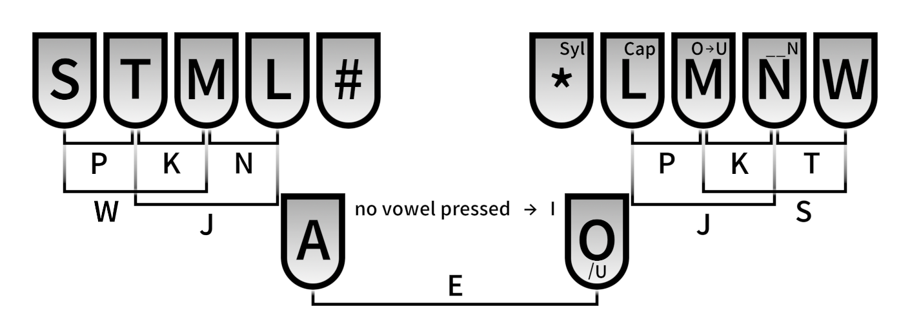

# A Toki Pona system for Plover #

This is a WIP 10+2 key system for typing Toki Pona.

## Layout ##

In this system, each word in Toki Pona is typed as a unique 3-letter code, generally corresponding to the first three letters. For example: 'toki' is TOK, 'kepeken' is KEP, etc.

Syllables for loanwords are typed similarly, using the extra functions in the right hand.

For example:
ilo Senokapi li pona tawa mi a

Currently working on support for sitelen pona fonts such as linja pona.

