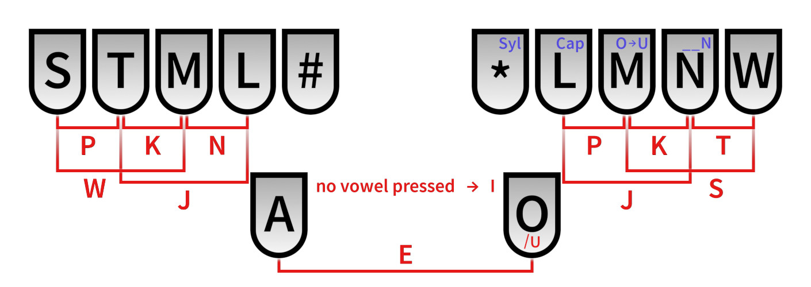

# A Toki Pona system for Plover #

This is a WIP 10+2 key stenotype system for Toki Pona.

## Layout and Theory ##

In this system, each word in Toki Pona is typed as a unique up-to-3 letter code, generally corresponding to the first three letters of the word. For example: 'toki' is TOK, 'kepeken' is KEP, etc. 

Syllables for loanwords are typed similarly, using the extra functions in the right hand. These handle capitalisation, U vowel, and final Ns.

For example:

original Toki Pona: ilo Senokapi li pona tawa mi a

raw steno: -L SA\*OL ML\*O TMA\* ST\* L- STON TAW M- A

Currently working on support for sitelen pona fonts such as linja pona.